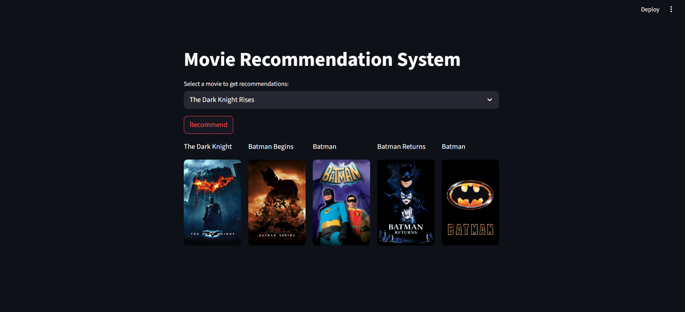

# 🎬 Movie Recommendation System (Python + ML)
🚀 **Try the live app here:** [Movies Recommend App](https://movies-recommend-system-monish.streamlit.app)


  
It suggests movies to users based on similarity scores calculated from movie features such as **genres, keywords, cast, and crew**.

---

## 🚀 Features
- 📊 Data preprocessing and cleaning of raw dataset.  
- 🧮 Content-based filtering using **cosine similarity**.  
- 🎥 Movie recommendations with titles and posters.  
- 🌐 Interactive **Streamlit web app** for easy use.  

---

## 🛠️ Tech Stack
- **Python**
- **Pandas, NumPy**
- **Scikit-learn**
- **Streamlit**
- **Pickle** (for saving the model)

---

## ⚙️ Installation & Setup
1. Clone the repository:
   ```bash
   git clone https://github.com/monish1716/Movies-Recommend-System.git
   cd Movies-Recommend-System

2. Download similarity.pkl:
   ```bash
   pip install gdown
   python download_similarity.py
   
4. Install dependencies:

pip install -r requirements.txt

3. Run the Streamlit app:

streamlit run app.py

---

## 📊 Dataset

The project uses the TMDB 5000 Movies Dataset, which contains:
Movie titles
Cast & crew details
Genres
Keywords
[TMDB Movies Dataset](https://www.kaggle.com/datasets/tmdb/tmdb-movie-metadata).
.

---

## 🎯 How It Works

Extract important features from the dataset (genres, cast, crew, keywords).
Apply preprocessing (remove duplicates, handle nulls, clean text).
Convert text data into vectors using CountVectorizer.
Compute cosine similarity between movies.
Recommend top 5 similar movies for any input.

---

## 🌐 Demo

After running the Streamlit app:
Enter a movie title in the input box.
Get top 5 recommended movies with posters.

---

## 📌 Example



---

## 🔮 Future Improvements
Add hybrid recommendation system (content + collaborative).
Deploy on HuggingFace Spaces / Render.
Integrate with real-time movie APIs.

---

## 🤝 Contributing

Pull requests are welcome.
For major changes, please open an issue first to discuss what you’d like to change.

---

## 📜 License

This project is licensed under the MIT License.
